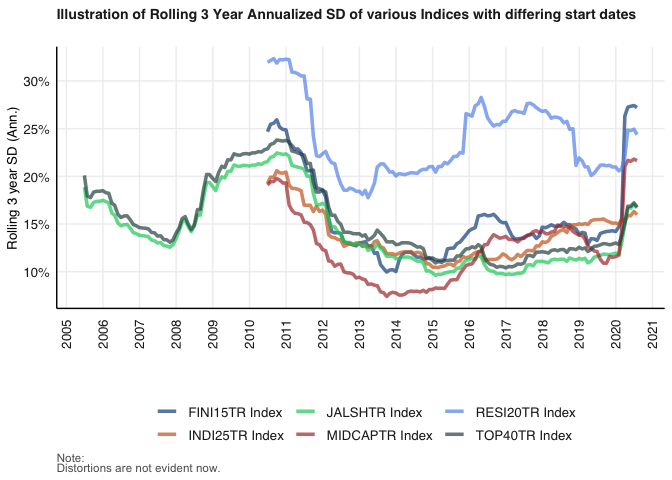

# Purpose

This is the first practical for the module Financial Econometrics 871.

``` r
rm(list = ls()) # Clean your environment:
gc() # garbage collection - It can be useful to call gc after a large object has been removed, as this may prompt R to return memory to the operating system.
```

    ##          used (Mb) gc trigger (Mb) limit (Mb) max used (Mb)
    ## Ncells 465406 24.9     995080 53.2         NA   669302 35.8
    ## Vcells 874371  6.7    8388608 64.0      16384  1840208 14.1

``` r
library(tidyverse)
```

    ## ── Attaching packages ─────────────────────────────────────── tidyverse 1.3.2 ──
    ## ✔ ggplot2 3.4.0     ✔ purrr   1.0.2
    ## ✔ tibble  3.2.1     ✔ dplyr   1.1.2
    ## ✔ tidyr   1.3.0     ✔ stringr 1.5.0
    ## ✔ readr   2.1.4     ✔ forcats 0.5.2
    ## ── Conflicts ────────────────────────────────────────── tidyverse_conflicts() ──
    ## ✖ dplyr::filter() masks stats::filter()
    ## ✖ dplyr::lag()    masks stats::lag()

``` r
library(fmxdat)

pacman::p_load("xts", "tidyverse", "tbl2xts", "PerformanceAnalytics", 
    "lubridate", "glue")

list.files('code/', full.names = T, recursive = T) %>% .[grepl('.R', .)] %>% as.list() %>% walk(~source(.))
```

    ## Warning: Using `size` aesthetic for lines was deprecated in ggplot2 3.4.0.
    ## ℹ Please use `linewidth` instead.
    ## This warning is displayed once every 8 hours.
    ## Call `lifecycle::last_lifecycle_warnings()` to see where this warning was
    ## generated.

    ## Warning in loadfonts_win(quiet = quiet): OS is not Windows. No fonts registered
    ## with windowsFonts().

    ## Warning: The `<scale>` argument of `guides()` cannot be `FALSE`. Use "none" instead as
    ## of ggplot2 3.3.4.
    ## This warning is displayed once every 8 hours.
    ## Call `lifecycle::last_lifecycle_warnings()` to see where this warning was
    ## generated.

``` r
pacman::p_load("xts", "tidyverse", "tbl2xts", "PerformanceAnalytics", 
    "lubridate", "glue")
```

#Date converter This function allows you to fill in dates between a
starting and end date. Again, this will save you pain in R:

``` r
library(rmsfuns)
dates1 <- dateconverter(as.Date("2000-01-01"), as.Date("2017-01-01"), 
    "alldays")
dates2 <- dateconverter(as.Date("2000-01-01"), as.Date("2017-01-01"), 
    "weekdays")
dates3 <- dateconverter(as.Date("2000-01-01"), as.Date("2017-01-01"), 
    "calendarEOM")  # Calendar end of month
dates4 <- dateconverter(as.Date("2000-01-01"), as.Date("2017-01-01"), 
    "weekdayEOW")  # weekday end of week
dates5 <- dateconverter(as.Date("2000-01-01"), as.Date("2017-01-01"), 
    "weekdayEOM")  # weekday end of month
dates6 <- dateconverter(as.Date("2000-01-01"), as.Date("2017-01-01"), 
    "weekdayEOQ")  # weekday end of quarter
dates7 <- dateconverter(as.Date("2000-01-01"), as.Date("2017-01-01"), 
    "weekdayEOY")  # weekday end of year
#This essentially creates an object of all the dates that you could want and then when you want to get returns for those particular dates it is easy to filter %in% the dates object you have created
```

#Build path (need to brush up on this) It can be challenging building
path structures in R, but build_path makes this easy. This could e.g. be
used in a function that creates folders and populates it with figures /
data points. E.g., suppose you want to create a folder structure as
follows:

/Results/Figures/Financials/Figures/Return_plot.png

/Results/Figures/Industrials/Figures/Return_plot.png

/Results/Figures/HealthCare/Figures/Return_plot.png

To create the folders to house the plots (and save their locations in a
vector to use it later), run:

``` r
# Specify a root on your computer, e.g.:
Root <- "/Users/wesleywilliams/Desktop/School/Masters/Second Semester/Fin Metrics/Practical 1"

# Specify the sectors:
Sectors <- c("Financials", "Industrials", "HealthCare")

# Construct the structure and bind them together:

# base R's paste0:
Locs <- build_path(paste0(Root, "/", Sectors, "/Figures/"))

# glue's glue... (preferred)
Locs <- build_path(glue::glue("{Root}/{Sectors}/Figures/"))

# I prefer the glue function as it makes nore intuitive sense to me glue requires {} and can place opjects inside the brackets
```

#tbl2xts package NB!!!

``` r
pacman::p_load("tbl2xts")
```

# ggplot Auxilliary functions

fmxdat now also comes with a suite of updated ggplot aux functions.

This should make coding easier and stop you from needing to google the
same commands frequently.

Let me illustrate a few additions:

``` r
library(tidyverse);library(fmxdat)

p <- 
  
  fmxdat::Jalshtr %>% mutate(Index = "ALSI") %>% 
  
  ggplot() + 
  
  geom_line(aes(date, TRI, color = Index), size = 2, alpha = 0.7) + 
  
  # Nice clean theme, with many additions that are now simplified (explore this yourself):
  # E.g. using fmxdat::ggpts, we can change the sizes more easily in millimeters. 
  # theme_fmx also offers simplified size settings, as e.g. below:
  
  fmxdat::theme_fmx(title.size = ggpts(30), 
                    subtitle.size = ggpts(28),
                    caption.size = ggpts(25),
                    # Makes nicer caption. If no caption given, this will break function, so careful:
                    CustomCaption = T) + 
  
  # crisp colours:
  fmxdat::fmx_cols() + 
  
  labs(x = "", y = "Cumulative Returns", caption = "Note:\nCalculation own",
       title = "Illustrating fmxdat Auxilliary functions for ggplot",
       subtitle = "If not subtitle, make blank and Subtitle size small to make a gap\nbetween plot and Title. Test this yourself") + 
  
  guides(color = F)
```

    ## Warning in loadfonts_win(quiet = quiet): OS is not Windows. No fonts registered
    ## with windowsFonts().

``` r
# Finplot now adds finishing touches easily:

  fmxdat::finplot(p, x.vert = T, x.date.type = "%Y", x.date.dist = "2 years")
```


``` r
  #These are all of the different ways to use finplot. Look at the help package to see what is required for each argument 
# #x.comma.sep  
# Make x axis not show scientific values (e.g. shows 25,000,000 as opposed to 2.5e+6)
# 
# y.comma.sep   
# Make y axis not show scientific values (e.g. shows 25,000,000 as opposed to 2.5e+6)
# 
# x.pct 
# Make x axis percentages
# 
# x.pct_acc 
# Rounding of pct value.
# 
# y.pct 
# Make y axis percentages
# 
# y.pct_acc 
# Rounding of pct value.
# 
# x.vert    
# flip x axis
# 
# y.vert    
# flip y axis
# 
# x.ticks.rm    
# Remove x ticks altogether
# 
# y.ticks.rm    
# Remove x ticks altogether
# 
# legend_pos    
# where to position legend. Defaults to bottom.
# 
# col.hue   
# set color hues. E.g., set hue = 40 to see what happens
# 
# fill.hue  
# set fill hues. E.g., set hue = 40 to see what happens
# 
# darkcol   
# Use dark colors
# 
# x.date.type   
# Of e.g. form '%Y', '%y_%b'
# 
# x.date.dist   
# Space between date points on x axis. E.g., "2 years", "10 week"
# 
# x.date.vector.sel 
# Provide a vector of possible dates - this way weekends and holidays are e.g. removed... use bdscale here. E.g. use: x.date.vector.sel = unique(df$date)
# 
# legend.line.size  
# Make legend lines larger
# 
# legend.text.size  
# Adj legend text
# 
# legend.line.alpha 
# Make legend lines lighter
# 
# log.y 
# Apply a log transformation on the y-axis. This is a log base 10 transformation
# 
# title.center  
# Put title in center of figure. Used with grids or facet wraps e.g.
```

# Return Series

The above loaded data currently is in Total Return Index (TRI) format.
This is a price adjusted for dividends, stock splits and other corporate
actions that will create pricing distortions.

When analyzing returns, always use TRI.

We would now like to transform it into a usable returns series for
further data analysis. This could be done using several techniques.

Let’s first discuss a primer on returns: From the class notes remember
we discussed:

Go and learn the different returns

Simple
$$
R_t = \frac{P_t}{P\_{t-1}}-1
$$
Simple Returns with dividends Dt
$$R_t = \frac{P_t+D_t-P\_{t-1}}{P\_{t-1}}=\frac{P_t}{P\_{t-1}}-1+\frac{D_t}{P\_{t-1}}$$
Simple real returns
$$ 1+ R_t^{Real} = \frac{p_t}{P\_{t-1}} \times \frac{CPI\_{t-1}}{CPI_t}
$$
Excess
*R*<sub>*t*</sub><sup>*e**x**c**e**s**s*</sup> = *R*<sub>*t*</sub> − *R*<sub>*R**F*</sub>
Continuously compounded (log) returns
$$  r_t = \frac{ln(P_t)}{ln(P\_{t-1})} = ln(P_t) - ln(P\_{t-1})$$
 = *l**n*(1+*R*<sub>*t*</sub>)
Log returns dividends adjusted
$$r_t = ln(1+R_t) = ln(\frac{P_t+D_t}{P\_{t-1}}) $$

 = *l**n*(*P*<sub>*t*</sub>+*D*<sub>*t*</sub>) − *l**n*(*P*<sub>*t* − 1</sub>)

#Tale of two returns Aggregation over time is easiest to do using log
returns (can sum across time dimensions), while aggregation over assets
is more easily done with simple returns (can sum across assets within
time t).

Let’s explore this a bit.

Calculating the weekly index simple returns (or cumulative returns):
$$
1+R_t\[k\] = \frac{P_t}{P\_{t-k}} = \frac{P_t}{P\_{t-1}} \times...\times \frac{P\_{t-k+1}}{P\_{t-k}}
$$
$$
= \prod\_{Pj=0}^{k-1}(1+R\_{t-j})
$$
Thus the k-period simple gross return is just the product of k
one-period simple returns. This is the compound return. NOTE: This is
different from the k-period simple net return
$$\frac{P\_{t-k+1}}{P\_{t-k}}$$
:

For Continuously compounded series its even easier. Here we just sum the
weekly returns to monthly (check the math and class notes!):

*r*<sub>*t*</sub>\[*k*\] = *r*<sub>*t*</sub> + ... + *t*<sub>*t* − *k* + 1</sub>

Which should we use? Bacon (2011) goes into great detail on the various
types of returns that can be calculated over and above the simple and
continuously compounded returns we mentioned here. Such returns could be
money-based or time-based, e.g., and depends on the needs and wants of
the investor. I omit a deeper discussion into this, but quote Bacon
(2011) in the following:

Continuously compounded returns should be used in statistical analysis
because, unlike simple returns, they are not positively biased… Bacon
(2011)(p.29).

Calculating simple returns of our five TRIs can then simply be done as
follows:

``` r
# although the columns are arranged by date, make sure of it
# first:
data <- fmxdat::BRICSTRI

d1 <- 
data %>% 
arrange(Date) %>% 
mutate_at(.vars = vars(-Date), ~./lag(.) - 1) %>% # Need to understand the period here through mutate_at (.vars 
#A list of columns generated by vars(), a character vector of column names, a numeric vector of column positions, or NULL.)
    slice(-1) # this is to remove the nas from the return calculation

#from the help documemtation:
# The scoped variants of mutate() and transmute() make it easy to apply the same transformation to multiple variables. There are three variants:
# 
# _all affects every variable
# 
# _at affects variables selected with a character vector or vars()
# 
# _if affects variables selected with a predicate function:

# Important to arrange by date, else the calculation will
# clearly be wrong

# Also note, the above is equivalent to using:
# mutate_at(.vars = vars(brz:zar), .funs = funs(./lag(.) -
# 1)) But this is terrible coding, as it requires constancy
# in order (imagine you added another series or changed the
# names to capital letters.)
```

Gathering Gathering and placing data into tidy format makes calculations
much easier and unleashes the real power of dplyr…

We will get to this later, but consider how the above can be done simply
as follows:

``` r
data %>% gather(Country, TRI, -Date)
```

    ## # A tibble: 3,950 × 3
    ##    Date       Country   TRI
    ##    <date>     <chr>   <dbl>
    ##  1 2000-01-14 brz     1420.
    ##  2 2000-01-21 brz     1382.
    ##  3 2000-01-28 brz     1344.
    ##  4 2000-02-04 brz     1426.
    ##  5 2000-02-11 brz     1416.
    ##  6 2000-02-18 brz     1372.
    ##  7 2000-02-25 brz     1385.
    ##  8 2000-03-03 brz     1439.
    ##  9 2000-03-10 brz     1424.
    ## 10 2000-03-17 brz     1383.
    ## # ℹ 3,940 more rows

``` r
#Gather (from wide to long and spread is the inverse)
# Notice that it is gathering data in a long format. Now we
# can compute returns as:
data %>% 
gather(Country, TRI, -Date) %>% 
group_by(Country) %>% 
mutate(Return = TRI/lag(TRI) - 1) %>% 
ungroup()
```

    ## # A tibble: 3,950 × 4
    ##    Date       Country   TRI   Return
    ##    <date>     <chr>   <dbl>    <dbl>
    ##  1 2000-01-14 brz     1420. NA      
    ##  2 2000-01-21 brz     1382. -0.0267 
    ##  3 2000-01-28 brz     1344. -0.0279 
    ##  4 2000-02-04 brz     1426.  0.0615 
    ##  5 2000-02-11 brz     1416. -0.00709
    ##  6 2000-02-18 brz     1372. -0.0315 
    ##  7 2000-02-25 brz     1385.  0.00960
    ##  8 2000-03-03 brz     1439.  0.0392 
    ##  9 2000-03-10 brz     1424. -0.0107 
    ## 10 2000-03-17 brz     1383. -0.0289 
    ## # ℹ 3,940 more rows

``` r
# The log returna cab easily becalculated useing dplyer
# Check that there are no missing values:
colSums(is.na(data))
```

    ## Date  brz  chn  ind  rus  zar 
    ##    0    0    0    0    0    0

``` r
# Calculate the log difference of each column:
d1 <- data %>% 
arrange(Date) %>% 
mutate_at(.vars = vars(brz:zar), ~log(.) - log(lag(.))) %>% #Remember log rules (ln(x/y)= lnx - lny)
    slice(-1)

colSums(is.na(d1))
```

    ## Date  brz  chn  ind  rus  zar 
    ##    0    0    0    0    0    0

``` r
# Again look at the function mutate at as it mutates multiplw columns at the same time (this is creating returns for all brics rather that doing it indiidually, could probably do it using group by but this function removes the "arbitraryness" of having to group by )
```

across across has now been introduced as a new verb to be used instead
of mutate_at.

I’m still warming to this, but I can see the merits. The above can be
rewritten now as:

``` r
d1 <- data %>% arrange(Date) %>% mutate(across(.cols = -Date, 
    .fns = ~log(.) - lag(log(.))))

# It think I prefer across as the .fns means functions to apply makes it easy to remember and .cols is the colloumns you want to apply it to
```

If you want to apply multiple functions inside across, as well as name
it, note the following notation:

``` r
data %>% 
arrange(Date) %>% 
gather(Tickers, Returns, -Date) %>% 
# Remember - before a function, just add ~
mutate(across(.cols = Returns, .fns = ~./lag(.) - 1, .names = "Simple_{col}")) %>% #Col will be "Returns"
    
mutate(across(.cols = Returns, .fns = ~log(.) - lag(log(.)), 
    .names = "Dlog_{col}")) %>% 
filter(Date > first(Date)) %>%  #This is the same as slicing but cant use slice as the data is in tidy format
group_by(Tickers) %>% 
mutate(across(.cols = c(starts_with("Simple"), starts_with("Dlog")), 
    .fns = list(Max = ~max(.), Min = ~min(.), Med = ~median(.)), 
    .names = "{fn}_{col}")) %>% #fn is the function so it will be max, min and median
ungroup()
```

    ## # A tibble: 3,945 × 11
    ##    Date       Tickers Returns Simple_Returns Dlog_Returns Max_Simple_Returns
    ##    <date>     <chr>     <dbl>          <dbl>        <dbl>              <dbl>
    ##  1 2000-01-21 brz       1382.       -0.0267      -0.0270               0.292
    ##  2 2000-01-28 brz       1344.       -0.0279      -0.0283               0.292
    ##  3 2000-02-04 brz       1426.        0.0615       0.0597               0.292
    ##  4 2000-02-11 brz       1416.       -0.00709     -0.00711              0.292
    ##  5 2000-02-18 brz       1372.       -0.0315      -0.0320               0.292
    ##  6 2000-02-25 brz       1385.        0.00960      0.00956              0.292
    ##  7 2000-03-03 brz       1439.        0.0392       0.0385               0.292
    ##  8 2000-03-10 brz       1424.       -0.0107      -0.0107               0.292
    ##  9 2000-03-17 brz       1383.       -0.0289      -0.0293               0.292
    ## 10 2000-03-24 brz       1459.        0.0555       0.0540               0.292
    ## # ℹ 3,935 more rows
    ## # ℹ 5 more variables: Min_Simple_Returns <dbl>, Med_Simple_Returns <dbl>,
    ## #   Max_Dlog_Returns <dbl>, Min_Dlog_Returns <dbl>, Med_Dlog_Returns <dbl>

``` r
# Need to brush up on this as i don't fully understand the seconnd last line where does the fn come from as it was never explicitly named, NVM i get it now
```

#Performance analytics package But if you’re a bit insecure about your
calcs, you could always use the PerformanceAnalytics package. This is a
very powerful package that can be used to do all kinds of risk, return
and portfolio calculations with.

The problem previously was the effort to move from dplyr to xts - so use
the tbl2xts package to facilitate this transition: (using tbl_xts and
xts_tbl) - we will cover it a bit further down…

``` r
library(PerformanceAnalytics)
library(tbl2xts)

d2 <- data %>% arrange(Date) %>% gather(Tickers, Returns, -Date) %>% 
    # You can skip gather and spread here - more for
# illustration:
tbl2xts::tbl_xts(cols_to_xts = Returns, spread_by = Tickers) %>% 
    PerformanceAnalytics::Return.calculate(., method = "log") %>% 
    tbl2xts::xts_tbl()

# Now you can compare d1 and d2 - they're exactly the same
# Here i think it will be good to follow the same steps and always gather and then withing the tbl_xts function spread_by otherwise I may confuse myself
```

To get the monthly returns from the weekly, we can simple trim the dates
to be the last date of the month: (note our earlier equations, tread
carefully here…)

First, let’s use the very nice feature of the as.Date(). Let’s define
the years and months as columns, and then using group_by to calculate
the monthly returns for each:

``` r
Year_Month <- function(x) format(as.Date(x), "%Y_%B")
# The following creates a Year and Month column:
cumdata <- 
data %>% 
mutate(YM = Year_Month(Date))

# Now we can use group_by() to calculate the monthly dlog
# returns for each numeric logret column: (Notice the use of
# mutate_if...)
cumdata_Logret_Monthly <- 
cumdata %>% 
arrange(Date) %>% 
filter(Date >= lubridate::ymd(20000128)) %>% #This is just the starting point, we are only concerned with dates larger
group_by(YM) %>% filter(Date == last(Date)) %>% #grouping by month the get the return for each month at the last day of the month
ungroup() %>% 
mutate(across(.cols = where(is.numeric), .fns = ~log(.) - lag(log(.)))) %>% 
    
filter(Date > first(Date)) %>% #again cannot use slice but this does the same thing
    mutate(Year = format(Date, "%Y")) %>% #now this is just creating a year variable to group by in next step
    
group_by(Year) %>% 
# Now we can sum to get to annual returns:
summarise(across(.cols = where(is.numeric), .fns = ~sum(.))) #using dlog returns they are summative through time 
```

Notice that if we had simple returns, it is not as simple as just
summing… We would need to chain geometrically (using cumprod) our weekly
returns and then calculate the monthly returns this way: Of course,
assuming we wanted to go weekly to monthly for illustration purposes,
you could’ve just taken the TRI returns for last day of month…

#Tidy format and simple returns (note above)

``` r
Year_Month <- function(x) format(as.Date(x), "%Y_%B") #same function as before
Cols_to_Gather <- data %>% select_if(is.numeric) %>% names() #this just gets the name of the cols and thats it as you can see below we use this object in "all_of" as the date is still wide so the tickers (or in this case the countries) are the column names

# First get weekly, then use that to get monthly (for
# illustration):
data %>% 
arrange(Date) %>% #always arrange by date (write this everytime to make sure you remember)
mutate(YM = Year_Month(Date)) %>% 
gather(Country, TRI, all_of(Cols_to_Gather)) %>% #get it in long format using the colnames object we created above
group_by(Country) %>% 
mutate(WeeklyReturn = TRI/lag(TRI) - 1) %>% #TRI is already in weakly format, if daily would do the same as weekly -> month
filter(Date >= lubridate::ymd(20000128)) %>% 
mutate(WeeklyReturn = coalesce(WeeklyReturn, 0)) %>% #the 0 is a replacement of na so returns are started at 0
mutate(MonthlyIndex = cumprod(1 + WeeklyReturn)) %>% 
group_by(YM) %>% 
filter(Date == last(Date)) %>% 
group_by(Country) %>% 
mutate(MonthlyReturn = MonthlyIndex/lag(MonthlyIndex) - 1)
```

    ## # A tibble: 910 × 7
    ## # Groups:   Country [5]
    ##    Date       YM           Country   TRI WeeklyReturn MonthlyIndex MonthlyReturn
    ##    <date>     <chr>        <chr>   <dbl>        <dbl>        <dbl>         <dbl>
    ##  1 2000-01-28 2000_January brz     1344.     -0.0279         0.972       NA     
    ##  2 2000-02-25 2000_Februa… brz     1385.      0.00960        1.00         0.0306
    ##  3 2000-03-31 2000_March   brz     1426.     -0.0230         1.03         0.0296
    ##  4 2000-04-28 2000_April   brz     1240.      0.0274         0.897       -0.131 
    ##  5 2000-05-26 2000_May     brz     1173.      0.0181         0.849       -0.0534
    ##  6 2000-06-30 2000_June    brz     1369.     -0.00220        0.991        0.167 
    ##  7 2000-07-28 2000_July    brz     1346.     -0.0524         0.974       -0.0167
    ##  8 2000-08-25 2000_August  brz     1401.      0.0143         1.01         0.0408
    ##  9 2000-09-29 2000_Septem… brz     1301.      0.00263        0.941       -0.0716
    ## 10 2000-10-27 2000_October brz     1169.     -0.0153         0.846       -0.101 
    ## # ℹ 900 more rows

Notice how returns have to be geometrically chained when summing accross
time-dimensions. For the simple returns, however, we can sum within
time-dimensions of course.

Below I assume an equally weight portfolio, rebalanced every week back
to equal weighted.

``` r
Cols_to_Gather <- data %>% select_if(is.numeric) %>% names

data %>% 
arrange(Date) %>% 
mutate(YM = Year_Month(Date)) %>% 
gather(Country, TRI, Cols_to_Gather) %>% 
mutate(Weight = 1/length(Cols_to_Gather)) %>% 
# By country to get return:
group_by(Country) %>% 
mutate(Ret = TRI/lag(TRI) - 1) %>% 
# By date to calculate EW portfolio:
group_by(Date) %>% 
summarise(EW_Port = sum(Ret * Weight, na.rm = T))
```

    ## Warning: Using an external vector in selections was deprecated in tidyselect 1.1.0.
    ## ℹ Please use `all_of()` or `any_of()` instead.
    ##   # Was:
    ##   data %>% select(Cols_to_Gather)
    ## 
    ##   # Now:
    ##   data %>% select(all_of(Cols_to_Gather))
    ## 
    ## See <https://tidyselect.r-lib.org/reference/faq-external-vector.html>.
    ## This warning is displayed once every 8 hours.
    ## Call `lifecycle::last_lifecycle_warnings()` to see where this warning was
    ## generated.

    ## # A tibble: 790 × 2
    ##    Date        EW_Port
    ##    <date>        <dbl>
    ##  1 2000-01-14  0      
    ##  2 2000-01-21 -0.0115 
    ##  3 2000-01-28 -0.0388 
    ##  4 2000-02-04  0.0222 
    ##  5 2000-02-11  0.00974
    ##  6 2000-02-18  0.0111 
    ##  7 2000-02-25 -0.0474 
    ##  8 2000-03-03  0.00559
    ##  9 2000-03-10  0.0445 
    ## 10 2000-03-17 -0.0347 
    ## # ℹ 780 more rows

#xts package nb!!!

Using tbl2xts you can now move very easily between data.frames and the
xts environment, and use it very easily in packages like
PerformanceAnalytics.

E.g., let’s use our previous random dataframe, and do some nice things
with it:

While the above is the by hand way of calculating such returns - we
could also use subsetting using the powerful xts package. See the
following useful commands (and keep these subsetting tools in mind with
your write-ups):

``` r
# ======== useful xts subsetting commands: First do the xts
# transformation:
xts.data <- tbl_xts(data)

# Subsetting the xts.data
xts.data["2013"]  # Dates in 2013
```

    ##                 brz     chn     ind      rus      zar
    ## 2013-01-04 7391.881 104.070 596.605 1094.919 1066.638
    ## 2013-01-11 7287.231 102.983 595.113 1114.484 1035.128
    ## 2013-01-18 7331.545 104.604 614.973 1138.663 1011.658
    ## 2013-01-25 7327.520 103.209 615.651 1150.097 1011.543
    ## 2013-02-01 7422.848 104.470 614.894 1156.720 1013.392
    ## 2013-02-08 7268.898 101.725 603.077 1128.231 1026.087
    ## 2013-02-15 7285.841 103.260 593.415 1113.681 1019.975
    ## 2013-02-22 7118.970  99.161 590.649 1100.166  993.586
    ## 2013-03-01 7138.064  99.611 570.090 1073.611  984.790
    ## 2013-03-08 7464.948 100.644 598.620 1086.126  997.162
    ## 2013-03-15 7250.764  96.457 594.244 1099.899  973.769
    ## 2013-03-22 6952.333  95.353 568.224 1054.875  951.209
    ## 2013-03-29 7088.484  95.558 573.333 1048.551  967.974
    ## 2013-04-05 7005.634  92.007 557.026 1013.899  939.207
    ## 2013-04-12 7102.749  94.227 555.299 1021.987  965.440
    ## 2013-04-19 6934.856  93.880 581.165  972.718  933.322
    ## 2013-04-26 6972.168  95.718 584.214 1002.870  950.398
    ## 2013-05-03 7147.493  96.451 600.337 1049.730  993.147
    ## 2013-05-10 7171.819  99.620 605.439 1058.750  985.070
    ## 2013-05-17 7132.684  97.894 613.703 1053.183  974.771
    ## 2013-05-24 7133.651  95.821 587.949 1045.739  940.709
    ## 2013-05-31 6708.940  95.824 579.713 1005.043  914.143
    ## 2013-06-07 6466.885  93.003 564.604  987.949  887.429
    ## 2013-06-14 6172.687  89.703 551.044  974.502  878.736
    ## 2013-06-21 5651.585  86.666 525.215  937.507  829.761
    ## 2013-06-28 5869.047  89.310 541.206  961.979  896.972
    ## 2013-07-05 5497.344  88.304 534.706  958.043  856.531
    ## 2013-07-12 5611.254  90.352 554.866 1021.032  910.780
    ## 2013-07-19 5803.916  90.784 561.074 1051.341  903.478
    ## 2013-07-26 5931.697  93.747 553.845 1019.589  907.438
    ## 2013-08-02 5836.109  94.112 520.235 1008.850  929.827
    ## 2013-08-09 5963.317  93.415 512.514 1003.215  939.523
    ## 2013-08-16 5839.076  97.600 501.178 1010.329  941.406
    ## 2013-08-23 5780.251  95.451 480.756 1018.003  921.674
    ## 2013-08-30 5659.611  95.197 469.626  992.183  907.060
    ## 2013-09-06 6031.651  99.152 486.202 1040.205  942.662
    ## 2013-09-13 6237.932 101.395 514.755 1077.008  982.701
    ## 2013-09-20 6494.021 103.052 534.006 1126.888  999.634
    ## 2013-09-27 6409.749 101.774 521.678 1102.347  983.306
    ## 2013-10-04 6489.006 102.033 534.758 1110.202  993.789
    ## 2013-10-11 6619.022 102.780 555.236 1138.985 1002.704
    ## 2013-10-18 6805.382 103.255 562.200 1168.082 1045.772
    ## 2013-10-25 6710.224  99.498 553.824 1145.843 1033.879
    ## 2013-11-01 6621.613 102.866 564.041 1135.652 1007.057
    ## 2013-11-08 6247.897 100.052 543.560 1107.520  974.625
    ## 2013-11-15 6437.357 102.207 532.575 1107.758  994.043
    ## 2013-11-22 6431.907 106.402 530.991 1111.893  983.857
    ## 2013-11-29 6303.165 107.761 547.698 1080.329  988.888
    ## 2013-12-06 6035.577 107.392 558.718 1063.601  971.027
    ## 2013-12-13 5915.258 104.784 548.849 1057.356  946.539
    ## 2013-12-20 5889.149 101.807 561.325 1090.995  979.399
    ## 2013-12-27 5996.639 103.846 565.724 1097.398  985.944

``` r
xts.data["2013/"]  # Dates since start of 2013
```

    ##                 brz     chn     ind      rus      zar
    ## 2013-01-04 7391.881 104.070 596.605 1094.919 1066.638
    ## 2013-01-11 7287.231 102.983 595.113 1114.484 1035.128
    ## 2013-01-18 7331.545 104.604 614.973 1138.663 1011.658
    ## 2013-01-25 7327.520 103.209 615.651 1150.097 1011.543
    ## 2013-02-01 7422.848 104.470 614.894 1156.720 1013.392
    ## 2013-02-08 7268.898 101.725 603.077 1128.231 1026.087
    ## 2013-02-15 7285.841 103.260 593.415 1113.681 1019.975
    ## 2013-02-22 7118.970  99.161 590.649 1100.166  993.586
    ## 2013-03-01 7138.064  99.611 570.090 1073.611  984.790
    ## 2013-03-08 7464.948 100.644 598.620 1086.126  997.162
    ##        ...                                           
    ## 2014-12-26 5152.166 109.806 684.785  661.866 1039.776
    ## 2015-01-02 4979.652 114.741 707.349  600.317 1039.306
    ## 2015-01-09 5106.532 116.151 709.426  629.734 1064.555
    ## 2015-01-16 5161.507 115.548 734.254  621.397 1041.719
    ## 2015-01-23 5230.194 118.664 767.406  664.649 1102.908
    ## 2015-01-30 4855.853 115.214 756.524  589.624 1105.807
    ## 2015-02-06 4888.198 115.913 755.078  666.172 1139.718
    ## 2015-02-13 4983.601 117.154 761.323  741.762 1126.164
    ## 2015-02-20 4941.129 117.693 765.682  732.947 1122.176
    ## 2015-02-27 4995.097 118.947 770.583  724.153 1113.172

``` r
xts.data["2015-1/2015-2"]  # Dates from start of Jan through to end of Feb 2015
```

    ##                 brz     chn     ind     rus      zar
    ## 2015-01-02 4979.652 114.741 707.349 600.317 1039.306
    ## 2015-01-09 5106.532 116.151 709.426 629.734 1064.555
    ## 2015-01-16 5161.507 115.548 734.254 621.397 1041.719
    ## 2015-01-23 5230.194 118.664 767.406 664.649 1102.908
    ## 2015-01-30 4855.853 115.214 756.524 589.624 1105.807
    ## 2015-02-06 4888.198 115.913 755.078 666.172 1139.718
    ## 2015-02-13 4983.601 117.154 761.323 741.762 1126.164
    ## 2015-02-20 4941.129 117.693 765.682 732.947 1122.176
    ## 2015-02-27 4995.097 118.947 770.583 724.153 1113.172

``` r
xts.data["/2008-9"]  # Dates prior to 2008 October (before Crisis period)
```

    ##                 brz    chn     ind      rus     zar
    ## 2000-01-14 1420.246 36.736 175.426  256.096 257.083
    ## 2000-01-21 1382.369 36.105 179.499  249.351 254.323
    ## 2000-01-28 1343.787 36.044 187.168  222.911 228.605
    ## 2000-02-04 1426.445 35.473 197.677  216.121 237.656
    ## 2000-02-11 1416.334 31.841 219.559  224.861 239.324
    ## 2000-02-18 1371.733 33.204 243.065  214.751 235.056
    ## 2000-02-25 1384.906 29.720 222.215  209.155 228.013
    ## 2000-03-03 1439.232 28.471 216.523  232.994 214.877
    ## 2000-03-10 1423.904 29.766 211.157  275.989 220.878
    ## 2000-03-17 1382.747 29.887 188.664  266.632 219.025
    ##        ...                                         
    ## 2008-07-25 8089.042 89.243 536.852 1479.361 673.458
    ## 2008-08-01 8281.959 89.793 549.962 1488.838 694.938
    ## 2008-08-08 7772.212 83.592 573.471 1318.571 661.746
    ## 2008-08-15 7365.972 79.873 546.693 1400.843 659.382
    ## 2008-08-22 7787.337 78.112 530.664 1304.049 670.459
    ## 2008-08-29 7688.035 82.100 529.787 1289.935 690.588
    ## 2008-09-05 6730.869 75.104 517.541 1143.832 622.171
    ## 2008-09-12 6664.815 69.997 486.434 1068.122 622.583
    ## 2008-09-19 6600.747 71.233 484.517 1070.611 622.587
    ## 2008-09-26 6325.049 67.940 445.549 1041.326 599.552

``` r
first(xts.data, "1 month")  # The first one month of xts.data
```

    ##                 brz    chn     ind     rus     zar
    ## 2000-01-14 1420.246 36.736 175.426 256.096 257.083
    ## 2000-01-21 1382.369 36.105 179.499 249.351 254.323
    ## 2000-01-28 1343.787 36.044 187.168 222.911 228.605

``` r
# Of course, you can easily truncate and move back to a
# tbl_df() by using: xts_tbl
truncated_df <- xts_tbl(xts.data["2013/"])
```

To see the potential of xts in subsetting daily returns, let’s create
use a daily return series and subset it:

``` r
dailydata <- fmxdat::DailyTRIs
# Let's focus our analysis only on three companies: SLM SJ,
# SOL SJ and TKG SJ
xts.data <- 
dailydata %>% 
select(Date, "SLM SJ", "SOL SJ") %>% 
tbl_xts()

# If you want to remove the SJ from the column names, use:
colnames(dailydata) <- 
gsub(" SJ", "", colnames(dailydata))

# Now we can pipe:
xts.data <- dailydata %>% 
select(Date, SLM, SOL) %>% tbl_xts()

### What can xts do?

# Use the generic .index* functions to extract certain months
# or days of month See : ?.index for more...
xts.data[.indexwday(xts.data) == 5]  # Friday's only
```

    ##             SLM   SOL
    ## 2003-01-03  768 10400
    ## 2003-01-10  770 10000
    ## 2003-01-17  760 10300
    ## 2003-01-24  750  9450
    ## 2003-01-31  735  9070
    ## 2003-02-07  728  8650
    ## 2003-02-14  740  8700
    ## 2003-02-21  737  9200
    ## 2003-02-28  710  9495
    ## 2003-03-07  655  8620
    ## 2003-03-14  627  8701
    ## 2003-03-28  625  8710
    ## 2003-04-04  655  8850
    ## 2003-04-11  623  8100
    ## 2003-04-25  600  7785
    ## 2003-05-02  585  8040
    ## 2003-05-09  618  8180
    ## 2003-05-16  615  8702
    ## 2003-05-23  630  8900
    ## 2003-05-30  655  9410
    ## 2003-06-06  720  8601
    ## 2003-06-13  713  8430
    ## 2003-06-20  725  8410
    ## 2003-06-27  700  8300
    ## 2003-07-04  748  8410
    ## 2003-07-11  751  8345
    ## 2003-07-18  760  8298
    ## 2003-07-25  740  8100
    ## 2003-08-01  750  7980
    ## 2003-08-08  730  7802
    ## 2003-08-15  716  7860
    ## 2003-08-22  754  8515
    ## 2003-08-29  725  8500
    ## 2003-09-05  752  8601
    ## 2003-09-12  760  8775
    ## 2003-09-19  755  8830
    ## 2003-09-26  763  8445
    ## 2003-10-03  780  8499
    ## 2003-10-10  857  9040
    ## 2003-10-17  845  9050
    ## 2003-10-24  810  8740
    ## 2003-10-31  850  9000
    ## 2003-11-07  876  9402
    ## 2003-11-14  850  9061
    ## 2003-11-21  840  8250
    ## 2003-11-28  845  8099
    ## 2003-12-05  862  8531
    ## 2003-12-12  847  9050
    ## 2003-12-19  869  9600
    ## 2004-01-02  888  9670
    ## 2004-01-09  865  9700
    ## 2004-01-16  867 11000
    ## 2004-01-23  849 10520
    ## 2004-01-30  880 10485
    ## 2004-02-06  885 10149
    ## 2004-02-13  917 10100
    ## 2004-02-20  911 10222
    ## 2004-02-27  915  9980
    ## 2004-03-05  927 10100
    ## 2004-03-12  899  9705
    ## 2004-03-19  881  9950
    ## 2004-03-26  904  9850
    ## 2004-04-02  930  9661
    ## 2004-04-16 1000  9901
    ## 2004-04-23  915 10090
    ## 2004-04-30  876 10440
    ## 2004-05-07  891 10560
    ## 2004-05-14  855  9500
    ## 2004-05-21  843  9500
    ## 2004-05-28  885  9885
    ## 2004-06-04  866  9860
    ## 2004-06-11  849  9752
    ## 2004-06-18  850  9921
    ## 2004-06-25  880 10026
    ## 2004-07-02  871  9720
    ## 2004-07-09  850  9480
    ## 2004-07-16  840  9800
    ## 2004-07-23  865 10272
    ## 2004-07-30  875 10375
    ## 2004-08-06  850 10453
    ## 2004-08-13  850 10965
    ## 2004-08-20  845 11600
    ## 2004-08-27  898 11650
    ## 2004-09-03  991 11450
    ## 2004-09-10  970 11775
    ## 2004-09-17  995 12380
    ## 2004-10-01 1080 12280
    ## 2004-10-08 1080 12801
    ## 2004-10-15 1084 12860
    ## 2004-10-22 1055 12640
    ## 2004-10-29 1078 12150
    ## 2004-11-05 1120 12370
    ## 2004-11-12 1145 12702
    ## 2004-11-19 1130 11695
    ## 2004-11-26 1251 11300
    ## 2004-12-03 1245 10998
    ## 2004-12-10 1180 11274
    ## 2004-12-17 1285 11665
    ## 2004-12-24 1290 11676
    ## 2004-12-31 1300 12100

``` r
xts.data[.indexwday(xts.data) == 1]  # Mondays only
```

    ##             SLM   SOL
    ## 2003-01-06  758 10270
    ## 2003-01-13  757 10341
    ## 2003-01-20  765 10295
    ## 2003-01-27  726  9520
    ## 2003-02-03  736  9010
    ## 2003-02-10  730  8830
    ## 2003-02-17  742  8911
    ## 2003-02-24  730  9460
    ## 2003-03-03  700  9470
    ## 2003-03-10  650  8391
    ## 2003-03-17  612  8700
    ## 2003-03-24  615  9005
    ## 2003-03-31  608  8700
    ## 2003-04-07  640  8700
    ## 2003-04-14  633  8200
    ## 2003-05-05  613  8000
    ## 2003-05-12  624  8406
    ## 2003-05-19  605  9001
    ## 2003-05-26  641  9200
    ## 2003-06-02  675  9550
    ## 2003-06-09  730  8696
    ## 2003-06-23  720  8410
    ## 2003-06-30  700  8355
    ## 2003-07-07  750  8399
    ## 2003-07-14  767  8450
    ## 2003-07-21  744  8225
    ## 2003-07-28  744  8090
    ## 2003-08-04  755  7950
    ## 2003-08-11  730  7900
    ## 2003-08-18  721  7890
    ## 2003-08-25  743  8400
    ## 2003-09-01  729  8790
    ## 2003-09-08  759  8760
    ## 2003-09-15  762  8801
    ## 2003-09-22  745  8550
    ## 2003-09-29  761  8700
    ## 2003-10-06  780  8420
    ## 2003-10-13  849  9030
    ## 2003-10-20  832  8985
    ## 2003-10-27  810  8700
    ## 2003-11-03  850  9170
    ## 2003-11-10  866  9295
    ## 2003-11-17  850  8826
    ## 2003-11-24  826  8320
    ## 2003-12-01  862  8500
    ## 2003-12-08  850  8832
    ## 2003-12-15  850  9100
    ## 2003-12-22  850  9620
    ## 2003-12-29  860  9500
    ## 2004-01-05  880  9550
    ## 2004-01-12  870  9899
    ## 2004-01-19  865 11000
    ## 2004-01-26  850 10435
    ## 2004-02-02  886 10600
    ## 2004-02-09  880 10250
    ## 2004-02-16  915 10049
    ## 2004-02-23  900 10170
    ## 2004-03-01  932 10100
    ## 2004-03-08  930 10150
    ## 2004-03-15  881  9750
    ## 2004-03-29  900  9680
    ## 2004-04-05  937  9720
    ## 2004-04-19  935 10201
    ## 2004-04-26  906  9938
    ## 2004-05-03  880 10500
    ## 2004-05-10  875  9945
    ## 2004-05-17  845  9350
    ## 2004-05-24  835  9181
    ## 2004-05-31  892 10075
    ## 2004-06-07  885  9966
    ## 2004-06-14  850  9719
    ## 2004-06-21  857  9950
    ## 2004-06-28  884  9851
    ## 2004-07-05  861  9700
    ## 2004-07-12  855  9570
    ## 2004-07-19  840  9821
    ## 2004-07-26  875 10370
    ## 2004-08-02  868 10300
    ## 2004-08-16  864 11420
    ## 2004-08-23  871 11780
    ## 2004-08-30  895 11700
    ## 2004-09-06  970 11460
    ## 2004-09-13  990 11840
    ## 2004-09-20  999 12435
    ## 2004-09-27 1075 12149
    ## 2004-10-04 1059 12350
    ## 2004-10-11 1072 13055
    ## 2004-10-18 1065 12705
    ## 2004-10-25 1050 12471
    ## 2004-11-01 1080 12120
    ## 2004-11-08 1160 12526
    ## 2004-11-15 1143 12600
    ## 2004-11-22 1135 11850
    ## 2004-11-29 1250 11510
    ## 2004-12-06 1200 10850
    ## 2004-12-13 1200 10962
    ## 2004-12-20 1260 11750

``` r
xts.data[.indexmon(xts.data) == 0]  # Date's in Jan in all years
```

    ##            SLM   SOL
    ## 2003-01-02 769 10500
    ## 2003-01-03 768 10400
    ## 2003-01-06 758 10270
    ## 2003-01-07 768 10400
    ## 2003-01-08 770 10300
    ## 2003-01-09 760 10199
    ## 2003-01-10 770 10000
    ## 2003-01-13 757 10341
    ## 2003-01-14 768 10140
    ## 2003-01-15 769 10430
    ## 2003-01-16 750 10560
    ## 2003-01-17 760 10300
    ## 2003-01-20 765 10295
    ## 2003-01-21 760 10100
    ## 2003-01-22 754  9950
    ## 2003-01-23 750  9651
    ## 2003-01-24 750  9450
    ## 2003-01-27 726  9520
    ## 2003-01-28 723  9520
    ## 2003-01-29 730  9360
    ## 2003-01-30 745  9345
    ## 2003-01-31 735  9070
    ## 2004-01-02 888  9670
    ## 2004-01-05 880  9550
    ## 2004-01-06 875  9515
    ## 2004-01-07 880  9810
    ## 2004-01-08 864  9630
    ## 2004-01-09 865  9700
    ## 2004-01-12 870  9899
    ## 2004-01-13 872 10350
    ## 2004-01-14 870 10550
    ## 2004-01-15 865 10751
    ## 2004-01-16 867 11000
    ## 2004-01-19 865 11000
    ## 2004-01-20 855 10950
    ## 2004-01-21 858 10350
    ## 2004-01-22 859 10500
    ## 2004-01-23 849 10520
    ## 2004-01-26 850 10435
    ## 2004-01-27 847 10450
    ## 2004-01-28 850 10201
    ## 2004-01-29 855 10460
    ## 2004-01-30 880 10485

``` r
xts.data[.indexmday(xts.data) == 1]  # First day of every month
```

    ##             SLM   SOL
    ## 2003-04-01  625  8998
    ## 2003-07-01  710  8350
    ## 2003-08-01  750  7980
    ## 2003-09-01  729  8790
    ## 2003-10-01  768  8125
    ## 2003-12-01  862  8500
    ## 2004-03-01  932 10100
    ## 2004-04-01  930  9900
    ## 2004-06-01  890 10180
    ## 2004-07-01  890  9700
    ## 2004-09-01  915 11195
    ## 2004-10-01 1080 12280
    ## 2004-11-01 1080 12120
    ## 2004-12-01 1220 11720

``` r
# Using the endpoints
xts.data[endpoints(xts.data, "months", k = 3)]  # Last day of every quarter (hence k = 3)
```

    ##             SLM   SOL
    ## 2003-03-31  608  8700
    ## 2003-06-30  700  8355
    ## 2003-09-30  763  8320
    ## 2003-12-31  880  9500
    ## 2004-03-31  920  9800
    ## 2004-06-30  880  9610
    ## 2004-09-30 1096 12050
    ## 2004-12-31 1300 12100

``` r
# Plotting with default lables is simple
plot(xts.data[, "SLM"], major.ticks = "years", minor.ticks = FALSE, 
    main = "Sanlam", col = 3, ylab = "SLM SJ TRI")
```


``` r
# Let's suppose SLM had some dates with no values. Let's
# create some random missing Values:
xts.data[150, "SLM"] <- NA

# xts.data[1990, "SLM"] <- NA

# If we now wanted to see whether there are any missing
# values and identify the dates:
index(xts.data)[is.na(xts.data)[, "SLM"]]
```

    ## [1] "2003-08-07"

``` r
# Let's proceed to 'pad' these NA values with the previous
# day's TRI values.  We do so using the last observation
# carried forward (na.locf) command - which thus looks for
# NA's, and replaces it with the previous valid return
# series. It goes back max 5 days in our example:
xts.data.padded <- na.locf(xts.data, na.rm = F, maxgap = 5)

# See what happened, compare non-padded and padded:
xts.data.padded["2003-08-05/2003-08-10"]$SLM
```

    ##            SLM
    ## 2003-08-05 756
    ## 2003-08-06 742
    ## 2003-08-07 742
    ## 2003-08-08 730

``` r
xts.data["2003-08-05/2003-08-10"]$SLM
```

    ##            SLM
    ## 2003-08-05 756
    ## 2003-08-06 742
    ## 2003-08-07  NA
    ## 2003-08-08 730

``` r
# To get the last date of each month / Week to create monthly
# returns:
xts.data.padded.monthly <- xts.data.padded[endpoints(xts.data.padded, 
    "months")]

xts.data.padded.weekly <- xts.data.padded[endpoints(xts.data.padded, 
    "weeks")]

# Create a monthly return series for each column:
xts.data.padded.monthly.returns <- diff.xts(xts.data.padded.monthly, 
    lag = 1, log = F, arithmetic = F) - 1 
# Notice that diff.xts() offers new params (lag, log,
# arithmetic arguments..)

# You can also quickly view periodicity as:
periodicity(xts.data.padded.monthly.returns)
```

    ## Monthly periodicity from 2003-01-31 to 2004-12-31

period.apply xts has a very powerful utility called period.apply.

See e.g. below how we can do quite advanced calcs pretty simply using
tbl_xts, xts and PerformanceAnalytics.

We first calculate daily log returns

we then calculate monthly annualised SD numbers.

``` r
library(tbl2xts)

library(PerformanceAnalytics)

#step by step 1) tidy 2) and then use tbl_xts and cols_to_xts the cols name, spread by what we gathered by 3) use the performance anaylytics package to calculate returns (it requires xts format) 4) after returns have been calculated then we can go back tibble using xts_tbl but it will again be wide so we want to gather to get it tidy again

dailydata <- fmxdat::DailyTRIs

dailydata <- 
dailydata %>% 
gather(Stocks, Px, -Date) %>% #remember that these will be the new column names with px being the value ie TRI
mutate(Stocks = gsub(" SJ", "", Stocks)) #this is just removing the SJ from eacah ticker

Monthly_Annualised_SD <- 
dailydata %>% 
# Make xts:
tbl_xts(., cols_to_xts = Px, spread_by = Stocks) %>% #We just want the value ie Px to be in xts fomat as we need it in wide format again thats why we sread_by stocks
PerformanceAnalytics::CalculateReturns(., method = "log") %>% #We want dlog returns
    
na.locf(., na.rm = F, maxgap = 5) %>% #Generic function for replacing each NA with the most recent non-NA prior to it
xts::apply.monthly(., FUN = PerformanceAnalytics::sd.annualized) %>% 
    
# Make tibble again:
xts_tbl() %>% 
gather(Stock, SD, -date) %>% mutate(date = as.Date(date))
```

Please see all the examples .

E.g., piping straight into a ggplot also follows trivially:

``` r
tbl2xts::TRI %>% 
tbl_xts(., cols_to_xts = TRI, spread_by = Country) %>% 
PerformanceAnalytics::Return.calculate(.) %>% 
xts::apply.yearly(., FUN = PerformanceAnalytics::CVaR) %>% 
xts_tbl %>% 
tidyr::gather(Country, CVaR, -date) %>% 
# Now plot it:
ggplot() + 
geom_line(aes(date, CVaR), color = "steelblue", size = 1.1, alpha = 0.8) + 
    
fmxdat::theme_fmx() + 
facet_wrap(~Country) + 
labs(x = "", title = "CVaR Plot example", subtitle = "Using tbl2xts package")
```

    ## Warning in loadfonts_win(quiet = quiet): OS is not Windows. No fonts registered
    ## with windowsFonts().


#Combining dplyr and tbl2xts While the above is nice, and there are
really awesome wrangling techniques to use in xts - I would prefer you
combine dplyr and xts to do the above.

See below for an example using the dplyr - xts - PerformanceAnalytics
combination to do, e.g., portfolio return calculations.

Let’s use our dailydata series to do some quick calcs:

calculate Returns (simple) for all stocks

Calculate the cumulative returns for our stocks (if you invested R1 in a
stock, what would you have now?)

Notice below - we will be using rmsfuns::Safe_Return.portfolio for
portfolio return calculation.

To see the motivation for this, please work through the following public
gist:

<https://gist.github.com/Nicktz/dddbe80ac427b7a96a58c39ef6e6f0d8>

``` r
# First: calculate ordinary returns
library(lubridate)

#------------------ 
# Step one: gather to make tidy:
dailydata <- fmxdat::DailyTRIs

colnames(dailydata) <- gsub(" SJ", "", colnames(dailydata))

Data_Adj <- 
dailydata %>% 
gather(Stocks, Price, -Date) %>% 
# Then arrange by date (as we'll be using lags)...
arrange(Date) %>% 
# Now calculate ordinary returns per stock:
group_by(Stocks) %>% 
mutate(Returns = Price/lag(Price) - 1) %>% ungroup()

#------------------ 
# Second: Calculate Cumulative Returns
CumRets <- 
Data_Adj %>% 
# for cumulative returns - we have to change NA to zero, else
# an NA would break the chain....
mutate(Returns = coalesce(Returns, 0)) %>% 
# Any NA in Returns is changed to zero
group_by(Stocks) %>% 
mutate(Cum_Ret = cumprod(1 + Returns))

# Bonus: Figure for Naspers:
ggplot(CumRets %>% filter(Stocks == "NPN")) + 
geom_line(aes(Date, Cum_Ret), color = "steelblue") + 
theme_bw() + labs(title = "Naspers cumulative Return", y = "Growth of R1 invested in 2003.")
```


``` r
#------------------ 
# Third: Calculate Equal weighted portfolio return First date
# wrangle...
Trimmed_Ret_Data <- 
Data_Adj %>% 
filter(Date >= lubridate::ymd(20030412) & Date < lubridate::ymd(20040101))

# Now, we will be using PerformanceAnalytics'
# Return.portfolio() which, if you type: ?Return.portfolio, #
# shows that it wants the weight vector as xts (with stock
# names and weights), as well as the returns in xts.  ...With
# tbl2xts, this is trivial.

# First the weights:
W_xts <- 
Trimmed_Ret_Data %>% 
# Check this cool trick:
filter(Date == first(Date)) %>% 
mutate(weight = 1/n()) %>% 
tbl_xts(., cols_to_xts = weight, spread_by = Stocks)

# Now Returns:
R_xts <- 
Trimmed_Ret_Data %>% 
tbl_xts(., cols_to_xts = Returns, spread_by = Stocks)

# Now... first ensure that column names between R_xts and
# W_xts match:
R_xts <- R_xts[, names(W_xts)]

# Set all NA returns to zero:
R_xts[is.na(R_xts)] <- 0
# Set all NA weights to zero:
W_xts[is.na(W_xts)] <- 0

# Also set NA's to zero:
Portfolio <- rmsfuns::Safe_Return.portfolio(R = R_xts, weights = W_xts, 
    geometric = TRUE)

Portf_Rets <- Portfolio$portfolio.returns %>% xts_tbl()  # because who has time for xts now...

# And that's a wrap. Simple!
```

#Performance analytics package Below I show you how to calculate some of
the metrics defined in Performance Analytics.

For a technical discussion into the definitions and uses of the return
metrics calculated in PerformanceAnalytics package, see Bacon (2011).

Plotting functionalities PA offers several useful plots for returns
time-series. E.g. using our xts.data.dailyreturns series before, let’s
look at the distributional properties of Sanlam:

``` r
pacman::p_load(tbl2xts, PerformanceAnalytics)

dailydata <- fmxdat::DailyTRIs

colnames(dailydata) <- gsub(" SJ", "", colnames(dailydata) )

xts.data.dailyreturns <- 
  
  dailydata %>% 
  
  gather(Stock, TRI, -Date) %>% 
  
  group_by(Stock) %>% 
  
  mutate(Return = TRI / lag(TRI)-1) %>%  
  
  ungroup() %>% 
  
  tbl_xts(tblData = ., cols_to_xts = Return, spread_by = Stock)

chart.Histogram(xts.data.dailyreturns$SLM, methods = "add.normal", 
                main = "Sanlam Histogram")
```


``` r
# Add normal line and VaR estimates
chart.Histogram(xts.data.dailyreturns$SLM, 
  methods = c("add.density", "add.normal", "add.risk"),
  main = "Adding Value at Risk (95%)")
```


``` r
chart.Boxplot(xts.data.dailyreturns$SLM, main = "Sanlam Boxplot")
```


``` r
chart.QQPlot(xts.data.dailyreturns$SLM, distribution = "norm", 
             main = "QQ-Plot of Sanlam")
```


``` r
chart.Drawdown(xts.data.dailyreturns$SLM,main = "Drawdowns: Sanlam", 
               col = "steelblue")
```


``` r
chart.CumReturns(xts.data.dailyreturns$SLM,main = "Drawdowns: Sanlam", 
               col = "steelblue")
```


``` r
chart.Scatter(x = xts.data.dailyreturns$SLM, 
              y = xts.data.dailyreturns$SOL, 
              main = "Scatter: Sanlam & Sasol", col = "steelblue", 
              xlab = "Sanlam", ylab = "Sasol")
```


``` r
## Or check out this risk-return scatter for several stocks since 2010...
chart.RiskReturnScatter(R=xts.data.dailyreturns['2003-01-01/'][,c("AGL", "AMS", "ANG", "AOD")])
```


``` r
chart.RollingPerformance(R=xts.data.dailyreturns['2003-01-01/'][,c("AGL", "AMS", "ANG", "AOD")],
                         
                         FUN="sd",
                         
                         width=120, 
                         
                         main="Rolling 120 day Standard Deviation", 
                         
                         legend.loc="bottomleft")
```


#DIY Attempt to replicate all these graphs in ggplot.

Financial Ratios PA also helps with the calculation of some crucial
financial ratios and metrics. You can browse through these from the
vignette, here follows a couple of highlights:

``` r
table.Stats(xts.data.dailyreturns["2003-01-01/"][, c("AGL", "AMS", 
    "ANG", "AOD")])
```

    ##                      AGL      AMS      ANG      AOD
    ## Observations    500.0000 500.0000 500.0000 175.0000
    ## NAs               1.0000   1.0000   1.0000 326.0000
    ## Minimum          -0.0629  -0.0632  -0.0536  -0.0882
    ## Quartile 1       -0.0141  -0.0054  -0.0050  -0.0149
    ## Median           -0.0019   0.0000   0.0001  -0.0003
    ## Arithmetic Mean  -0.0005   0.0019   0.0012   0.0005
    ## Geometric Mean   -0.0007   0.0017   0.0011   0.0001
    ## Quartile 3        0.0127   0.0083   0.0076   0.0121
    ## Maximum           0.0804   0.0839   0.0500   0.0801
    ## SE Mean           0.0010   0.0007   0.0006   0.0020
    ## LCL Mean (0.95)  -0.0024   0.0005   0.0001  -0.0035
    ## UCL Mean (0.95)   0.0014   0.0032   0.0024   0.0044
    ## Variance          0.0005   0.0002   0.0002   0.0007
    ## Stdev             0.0218   0.0154   0.0134   0.0265
    ## Skewness          0.2228   0.2732   0.0509   0.4171
    ## Kurtosis          0.6652   3.4540   2.6745   1.1238

``` r
table.TrailingPeriods(R = xts.data.dailyreturns["2003-01-01/"][, 
    c("AGL", "AMS", "ANG", "AOD")], periods = c(3, 6, 12, 36, 
    60))
```

    ##                         AGL    AMS     ANG     AOD
    ## Last 3 day Average  -0.0146 0.0037  0.0074 -0.0073
    ## Last 6 day Average  -0.0088 0.0028  0.0074  0.0177
    ## Last 12 day Average -0.0040 0.0007 -0.0006  0.0100
    ## Last 36 day Average -0.0050 0.0042  0.0039  0.0080
    ## Last 60 day Average -0.0035 0.0032  0.0053  0.0009
    ## Last 3 day Std Dev   0.0097 0.0032  0.0108  0.0256
    ## Last 6 day Std Dev   0.0109 0.0058  0.0092  0.0385
    ## Last 12 day Std Dev  0.0108 0.0059  0.0160  0.0295
    ## Last 36 day Std Dev  0.0136 0.0199  0.0163  0.0236
    ## Last 60 day Std Dev  0.0177 0.0187  0.0162  0.0271

``` r
table.DownsideRisk(xts.data.dailyreturns["2003-01-01/"][, c("AGL", 
    "AMS", "ANG", "AOD")])
```

    ##                                   AGL     AMS     ANG     AOD
    ## Semi Deviation                 0.0150  0.0105  0.0093  0.0174
    ## Gain Deviation                 0.0146  0.0119  0.0100  0.0201
    ## Loss Deviation                 0.0132  0.0107  0.0094  0.0152
    ## Downside Deviation (MAR=210%)  0.0204  0.0143  0.0136  0.0222
    ## Downside Deviation (Rf=0%)     0.0153  0.0096  0.0087  0.0171
    ## Downside Deviation (0%)        0.0153  0.0096  0.0087  0.0171
    ## Maximum Drawdown               0.4275  0.1688  0.2181  0.3968
    ## Historical VaR (95%)          -0.0364 -0.0210 -0.0182 -0.0385
    ## Historical ES (95%)           -0.0460 -0.0326 -0.0297 -0.0520
    ## Modified VaR (95%)            -0.0347 -0.0212 -0.0198 -0.0391
    ## Modified ES (95%)             -0.0438 -0.0290 -0.0292 -0.0486

Using PerformanceAnalytics’ own data, see the following summary metrics
of fund performance relative to benchmarks:

``` r
data(managers)

Rf <- managers$"US 3m TR"  # Risk-free rate

Rb <- managers$"SP500 TR"  # Benchmark

# CAPM Beta:
CAPM.beta(Ra = managers$HAM1, Rb = Rb, Rf = Rf)
```

    ## [1] 0.3900712

``` r
# As it is monthly data, alpha would then be calculated as:
(1 + CAPM.alpha(Ra = managers$HAM1, Rb = Rb, Rf = Rf))^12 - 1
```

    ## [1] 0.0715406

``` r
# Rolling 24 month Beta:
chart.RollingRegression(Ra = managers$HAM1, Rb = Rb, width = 24, 
    attribute = c("Beta"))
```


``` r
# Summary:
table.SFM(Ra = managers$HAM1, Rb = Rb)
```

    ##                     HAM1 to SP500 TR
    ## Alpha                         0.0077
    ## Beta                          0.3906
    ## Beta+                         0.3010
    ## Beta-                         0.4257
    ## R-squared                     0.4357
    ## Annualized Alpha              0.0969
    ## Correlation                   0.6601
    ## Correlation p-value           0.0000
    ## Tracking Error                0.1132
    ## Active Premium                0.0408
    ## Information Ratio             0.3604
    ## Treynor Ratio                 0.3521

#Your turn…. Load the J200 index prices since 2017 using the code below.

Compare the Financials and Industrials returns for 2017.

Find the 5 most volatile stocks for the index.

TIP: use: mutate(SD = sd(Returns, na.rm = TRUE)) %\>% top_n(5, SD) Use
PerformanceAnalytics and compare the maximum drawdowns of the
Industrials versus the Consumer Goods sectors.

Calculate all the Betas for the J200 stocks for 2018 (I’ll help you with
this one below…).

``` r
J200 <- fmxdat::J200

# Rolling Betas:
df_J200 <- 
  
  J200 %>% 
  
  group_by(Tickers) %>% 
  
  mutate(Ret = Prices / lag(Prices) - 1) %>% 
  
  group_by(date) %>%
  
  mutate(J200 = sum(Ret * weight_Adj, na.rm=T)) %>% 
  
  ungroup()

TickChoice <- paste0( c("BIL", "SBK", "SOL"), " SJ Equity")

PerformanceAnalytics::chart.RollingRegression(Ra = df_J200 %>% filter(Tickers %in% TickChoice) %>%  
                                                
                                                mutate(Ret = coalesce(Ret, 0) ) %>% 
                                                tbl_xts(., cols_to_xts = Ret, spread_by = Tickers),
                                              Rb = df_J200 %>% group_by(date) %>% summarise(J200 = max(J200)) %>%
                                                tbl_xts(., cols_to_xts = J200),width=120,attribute = c("Beta"), legend.loc = "top")
```


``` r
# Static Betas:

CAPM.beta(Ra=df_J200 %>% filter(Tickers %in% TickChoice) %>%  
            mutate(Ret = coalesce(Ret, 0) ) %>%
            tbl_xts(., cols_to_xts = "Ret", spread_by = "Tickers"),
          Rb=df_J200 %>% group_by(date) %>% summarise(J200 = max(J200)) %>% tbl_xts(., cols_to_xts = "J200"))
```

    ##            BIL.SJ.Equity SBK.SJ.Equity SOL.SJ.Equity
    ## Beta: J200        1.0767      1.006321     0.8019374

#Annualizing Returns Something that can easily confuse young analysts is
when and how to annualize returns.

The idea behind annualizing returns is to be able to make direct
comparisons of returns across different time periods.

Let’s take the following example - you have been tasked to create a
barplot of the annualized returns of the different ALSI sector indices
using their monthly returns, on a 6 month, 12 month, 3 year, 5 year and
10 year basis, annualized. Do so for the following sectors: FINI, INDI,
RESI, ALSI, MIDCAPS, and ALSI TOP40.

The following code chunk will achieve this manually. I will also show
you an easy way to verify your numbers using PerformanceAnalytics
afterwards.

``` r
options(dplyr.summarise.inform = F)
library(lubridate)

# make returns monthly for illustration:
idx <- fmxdat::SA_Indexes %>% 
filter(Tickers %in% c("FINI15TR Index", "INDI25TR Index", "JALSHTR Index", 
    "MIDCAPTR Index", "RESI20TR Index", "TOP40TR Index")) %>% 
    
mutate(YM = format(date, "%Y%B")) %>% 
arrange(date) %>% 
group_by(Tickers, YM) %>% filter(date == last(date)) %>% 
group_by(Tickers) %>% 
mutate(ret = Price/lag(Price) - 1) %>% select(date, Tickers, 
    ret) %>% ungroup()
```

Now - be careful with the trick below to calculate past returns using
monthly data.

You will be tempted to calculate 6 month returns using:

``` r
idx %>% filter(date > last(date) %m-% months(6)) %>% summarise(mu = prod(1 + 
    ret, na.rm = T)^(12/(6)) - 1)
```

    ## # A tibble: 1 × 1
    ##       mu
    ##    <dbl>
    ## 1 -0.443

While this is correct for the above, notice that the lagging of six
months needs to be carefully done depending on when the month ended. If
it ended Feb 28, then last(date) %m-% months(6) would give you 7 months.
Check:

``` r
idx %>% filter(date > last(date) %m-% months(6)) %>% pull(date) %>% 
    unique
```

    ## [1] "2020-02-28" "2020-03-31" "2020-04-30" "2020-05-29" "2020-06-30"
    ## [6] "2020-07-31"

``` r
idx %>% filter(date <= ymd(20200228)) %>% filter(date > last(date) %m-% 
    months(6)) %>% pull(date) %>% unique
```

    ## [1] "2019-08-30" "2019-09-30" "2019-10-31" "2019-11-29" "2019-12-31"
    ## [6] "2020-01-31" "2020-02-28"

Argue for yourself why this is the case using this format.

You should use, in such instances, instead use the following function
for safer lagging of months this way (to get what we want to achieve):

``` r
idx %>% filter(date >= fmxdat::safe_month_min(last(date), N = 6)) %>% 
    pull(date) %>% unique
```

    ## [1] "2020-02-28" "2020-03-31" "2020-04-30" "2020-05-29" "2020-06-30"
    ## [6] "2020-07-31"

``` r
idx %>% filter(date <= ymd(20200228)) %>% filter(date >= fmxdat::safe_month_min(last(date), 
    N = 6)) %>% pull(date) %>% unique
```

    ## [1] "2019-09-30" "2019-10-31" "2019-11-29" "2019-12-31" "2020-01-31"
    ## [6] "2020-02-28"

``` r
# And the equivalent fmxdat::safe_year_min for years


# Now, see my trick below to order and rename facet_wraps for plotting using Freq = A, B, ... (you'll see in the plot function why this is done)

#======================
# Manual Calculation:
#======================

dfplot <- 
  
    bind_rows(
      
      # Don't annualize for less than a year, e.g.:
      idx %>% filter(date >= fmxdat::safe_month_min(last(date), N = 6)) %>% group_by(Tickers) %>% 
        summarise(mu = prod(1+ret, na.rm=T) ^ (12/(6)) -1 ) %>% mutate(Freq = "A"),
      
      idx %>% filter(date >= fmxdat::safe_month_min(last(date), N = 12))  %>% group_by(Tickers) %>% 
        summarise(mu = prod(1+ret, na.rm=T) ^ (12/(12)) -1 ) %>% mutate(Freq = "B"),
      
            idx %>% filter(date >= fmxdat::safe_month_min(last(date), N = 36)) %>% group_by(Tickers) %>% 
        summarise(mu = prod(1+ret, na.rm=T) ^ (12/(36)) -1 ) %>% mutate(Freq = "C"),
      
      idx %>% filter(date >= fmxdat::safe_month_min(last(date), N = 60)) %>% group_by(Tickers) %>% 
        summarise(mu = prod(1+ret, na.rm=T) ^ (12/(60)) -1 ) %>% mutate(Freq = "D")
      
    )

#======================
# PerformanceAnalytics
#======================
library(tbl2xts);library(PerformanceAnalytics);library(fmxdat)
idxxts <- 
  tbl_xts(idx, cols_to_xts = ret, spread_by = Tickers)
dfplotxts <- 
  
    bind_rows(
      # Don't annualize for less than a year, e.g.:
      idxxts %>% tail(6) %>% PerformanceAnalytics::Return.annualized(., scale = 12) %>% data.frame() %>% mutate(Freq = "A"),
      
      idxxts %>% tail(12) %>% PerformanceAnalytics::Return.annualized(., scale = 12) %>% data.frame() %>% mutate(Freq = "B"),
      
      idxxts %>% tail(36) %>% PerformanceAnalytics::Return.annualized(., scale = 12) %>% data.frame() %>% mutate(Freq = "C"),
      
      idxxts %>% tail(60) %>% PerformanceAnalytics::Return.annualized(., scale = 12) %>% data.frame() %>% mutate(Freq = "D"),
      
    ) %>% data.frame() %>% gather(Tickers, mu, -Freq) %>% 
  mutate(Tickers = gsub("\\.", " ", Tickers))


# Barplot_foo:
to_string <- as_labeller(c(`A` = "6 Months", `B` = "1 Year", `C` = "3 Years", `D` = "5 Years"))

  g <- 
    
  dfplot %>%
  
  # Compare to (they are the exact same):
  # dfplotxts %>%
    
  ggplot() + 
    
  geom_bar( aes(Tickers, mu, fill = Tickers), stat="identity") + 
    
  facet_wrap(~Freq, labeller = to_string, nrow = 1) + 
    
  labs(x = "", y = "Returns (Ann.)" , caption = "Note:\nReturns in excess of a year are in annualized terms.") + 
    
  fmx_fills() + 
    
  geom_label(aes(Tickers, mu, label = paste0( round(mu, 4)*100, "%" )), size = ggpts(8), alpha = 0.35, fontface = "bold", nudge_y = 0.002) + 
    
  theme_fmx(CustomCaption = T, title.size = ggpts(43), subtitle.size = ggpts(38), 
                caption.size = ggpts(30), 
            
                axis.size = ggpts(37), 
            
                legend.size = ggpts(35),legend.pos = "top") +

  theme(axis.text.x = element_blank(), axis.title.y = element_text(vjust=2)) + 
    
  theme(strip.text.x = element_text(face = "bold", size = ggpts(35), margin = margin(.1, 0, .1, 0, "cm"))) 
```

    ## Warning in loadfonts_win(quiet = quiet): OS is not Windows. No fonts registered
    ## with windowsFonts().

``` r
g
```


#Calculating Rolling Returns Another very important calculation for
evaluating and comparing the performance of different indices is to
calculate rolling returns.

This follows as cumulative returns, while insightful in itself, can be a
misleading figure as early outperformance can greatly skew later
performance. Also, if funds / indices have different start dates, the
figure itself will also be distorted.

See example below where we first compare the cumulative returns of
several selected Indices (using idx as defined above), noting the
distortion effects it creates, even after considering log cumulative
returns (which controls for the level effects):

``` r
gg <- idx %>% 
arrange(date) %>% group_by(Tickers) %>% 
# Set NA Rets to zero to make cumprod work:
mutate(Rets = coalesce(ret, 0)) %>% 
mutate(CP = cumprod(1 + Rets)) %>% 
ungroup() %>% 
ggplot() + 
geom_line(aes(date, CP, color = Tickers)) + 
labs(title = "Illustration of Cumulative Returns of various Indices with differing start dates", 
    subtitle = "", caption = "Note:\nDistortions emerge as starting dates differ.") + 
    theme_fmx(title.size = ggpts(30), subtitle.size = ggpts(5), 
        caption.size = ggpts(25), CustomCaption = T)
```

    ## Warning in loadfonts_win(quiet = quiet): OS is not Windows. No fonts registered
    ## with windowsFonts().

``` r
# Level plot
gg
```


``` r
gg + coord_trans(y = "log10") + labs(title = paste0(gg$labels$title, 
    "\nLog Scaled"), y = "Log Scaled Cumulative Returns")
```


Notice that the above cannot be sensibly interpreted - and also doesn’t
show the extent of outperformance recently of the RESI20.

For this reason, we often look at rolling returns, in order to give a
better indication of the actual performance comparison of different
funds.

Let’s compare the returns above now on a rolling 3 year annualized
basis:

``` r
plotdf <- 
idx %>% group_by(Tickers) %>% 
# Epic sorcery:
mutate(RollRets = RcppRoll::roll_prod(1 + ret, 36, fill = NA, 
    align = "right")^(12/36) - 1) %>% 
# Note this cool trick: it removes dates that have no
# RollRets at all.

group_by(date) %>% filter(any(!is.na(RollRets))) %>% 
ungroup()

g <- 
plotdf %>% 
ggplot() + 
geom_line(aes(date, RollRets, color = Tickers), alpha = 0.7, 
    size = 1.25) + 
labs(title = "Illustration of Rolling 3 Year Annualized Returns of various Indices with differing start dates", 
    subtitle = "", x = "", y = "Rolling 3 year Returns (Ann.)", 
    caption = "Note:\nDistortions are not evident now.") + theme_fmx(title.size = ggpts(30), 
    subtitle.size = ggpts(5), caption.size = ggpts(25), CustomCaption = T) + 
    
fmx_cols()
```

    ## Warning in loadfonts_win(quiet = quiet): OS is not Windows. No fonts registered
    ## with windowsFonts().

``` r
finplot(g, x.date.dist = "1 year", x.date.type = "%Y", x.vert = T, 
    y.pct = T, y.pct_acc = 1)
```

    ## Warning: Removed 144 rows containing missing values (`geom_line()`).


Now - be careful with the trick below to calculate past returns using
monthly data.

You will be tempted to calculate 6 month returns using:

``` r
idx %>% filter(date > last(date) %m-% months(6)) %>% summarise(mu = prod(1 + 
    ret, na.rm = T)^(12/(6)) - 1)
```

    ## # A tibble: 1 × 1
    ##       mu
    ##    <dbl>
    ## 1 -0.443

While this is correct for the above, notice that the lagging of six
months needs to be carefully done depending on when the month ended. If
it ended Feb 28, then last(date) %m-% months(6) would give you 7 months.
Check:

``` r
idx %>% filter(date > last(date) %m-% months(6)) %>% pull(date) %>% 
    unique
```

    ## [1] "2020-02-28" "2020-03-31" "2020-04-30" "2020-05-29" "2020-06-30"
    ## [6] "2020-07-31"

``` r
idx %>% filter(date <= ymd(20200228)) %>% filter(date > last(date) %m-% 
    months(6)) %>% pull(date) %>% unique
```

    ## [1] "2019-08-30" "2019-09-30" "2019-10-31" "2019-11-29" "2019-12-31"
    ## [6] "2020-01-31" "2020-02-28"

Argue for yourself why this is the case using this format.

You should use, in such instances, instead use the following function
for safer lagging of months this way (to get what we want to achieve):

``` r
idx %>% filter(date >= fmxdat::safe_month_min(last(date), N = 6)) %>% 
    pull(date) %>% unique
```

    ## [1] "2020-02-28" "2020-03-31" "2020-04-30" "2020-05-29" "2020-06-30"
    ## [6] "2020-07-31"

``` r
idx %>% filter(date <= ymd(20200228)) %>% filter(date >= fmxdat::safe_month_min(last(date), 
    N = 6)) %>% pull(date) %>% unique
```

    ## [1] "2019-09-30" "2019-10-31" "2019-11-29" "2019-12-31" "2020-01-31"
    ## [6] "2020-02-28"

``` r
# And the equivalent fmxdat::safe_year_min for years
```

My answer here surfaced recently with someone again adding this is the
most sensible solution. The above function is tailored from this logic
(for the reverse).

``` r
# Now, see my trick below to order and rename facet_wraps for plotting using Freq = A, B, ... (you'll see in the plot function why this is done)

#======================
# Manual Calculation:
#======================

dfplot <- 
  
    bind_rows(
      
      # Don't annualize for less than a year, e.g.:
      idx %>% filter(date >= fmxdat::safe_month_min(last(date), N = 6)) %>% group_by(Tickers) %>% 
        summarise(mu = prod(1+ret, na.rm=T) ^ (12/(6)) -1 ) %>% mutate(Freq = "A"),
      
      idx %>% filter(date >= fmxdat::safe_month_min(last(date), N = 12))  %>% group_by(Tickers) %>% 
        summarise(mu = prod(1+ret, na.rm=T) ^ (12/(12)) -1 ) %>% mutate(Freq = "B"),
      
            idx %>% filter(date >= fmxdat::safe_month_min(last(date), N = 36)) %>% group_by(Tickers) %>% 
        summarise(mu = prod(1+ret, na.rm=T) ^ (12/(36)) -1 ) %>% mutate(Freq = "C"),
      
      idx %>% filter(date >= fmxdat::safe_month_min(last(date), N = 60)) %>% group_by(Tickers) %>% 
        summarise(mu = prod(1+ret, na.rm=T) ^ (12/(60)) -1 ) %>% mutate(Freq = "D")
      
    )

#======================
# PerformanceAnalytics
#======================
library(tbl2xts);library(PerformanceAnalytics);library(fmxdat)
idxxts <- 
  tbl_xts(idx, cols_to_xts = ret, spread_by = Tickers)
dfplotxts <- 
  
    bind_rows(
      # Don't annualize for less than a year, e.g.:
      idxxts %>% tail(6) %>% PerformanceAnalytics::Return.annualized(., scale = 12) %>% data.frame() %>% mutate(Freq = "A"),
      
      idxxts %>% tail(12) %>% PerformanceAnalytics::Return.annualized(., scale = 12) %>% data.frame() %>% mutate(Freq = "B"),
      
      idxxts %>% tail(36) %>% PerformanceAnalytics::Return.annualized(., scale = 12) %>% data.frame() %>% mutate(Freq = "C"),
      
      idxxts %>% tail(60) %>% PerformanceAnalytics::Return.annualized(., scale = 12) %>% data.frame() %>% mutate(Freq = "D"),
      
    ) %>% data.frame() %>% gather(Tickers, mu, -Freq) %>% 
  mutate(Tickers = gsub("\\.", " ", Tickers))


# Barplot_foo:
to_string <- as_labeller(c(`A` = "6 Months", `B` = "1 Year", `C` = "3 Years", `D` = "5 Years"))

  g <- 
    
  dfplot %>%
  
  # Compare to (they are the exact same):
  # dfplotxts %>%
    
  ggplot() + 
    
  geom_bar( aes(Tickers, mu, fill = Tickers), stat="identity") + 
    
  facet_wrap(~Freq, labeller = to_string, nrow = 1) + 
    
  labs(x = "", y = "Returns (Ann.)" , caption = "Note:\nReturns in excess of a year are in annualized terms.") + 
    
  fmx_fills() + 
    
  geom_label(aes(Tickers, mu, label = paste0( round(mu, 4)*100, "%" )), size = ggpts(8), alpha = 0.35, fontface = "bold", nudge_y = 0.002) + 
    
  theme_fmx(CustomCaption = T, title.size = ggpts(43), subtitle.size = ggpts(38), 
                caption.size = ggpts(30), 
            
                axis.size = ggpts(37), 
            
                legend.size = ggpts(35),legend.pos = "top") +

  theme(axis.text.x = element_blank(), axis.title.y = element_text(vjust=2)) + 
    
  theme(strip.text.x = element_text(face = "bold", size = ggpts(35), margin = margin(.1, 0, .1, 0, "cm"))) 
```

    ## Warning in loadfonts_win(quiet = quiet): OS is not Windows. No fonts registered
    ## with windowsFonts().

``` r
g
```


#Calculating Rolling Returns Another very important calculation for
evaluating and comparing the performance of different indices is to
calculate rolling returns.

This follows as cumulative returns, while insightful in itself, can be a
misleading figure as early outperformance can greatly skew later
performance. Also, if funds / indices have different start dates, the
figure itself will also be distorted.

See example below where we first compare the cumulative returns of
several selected Indices (using idx as defined above), noting the
distortion effects it creates, even after considering log cumulative
returns (which controls for the level effects):

``` r
gg <- idx %>% 
arrange(date) %>% group_by(Tickers) %>% 
# Set NA Rets to zero to make cumprod work:
mutate(Rets = coalesce(ret, 0)) %>% 
mutate(CP = cumprod(1 + Rets)) %>% 
ungroup() %>% 
ggplot() + 
geom_line(aes(date, CP, color = Tickers)) + 
labs(title = "Illustration of Cumulative Returns of various Indices with differing start dates", 
    subtitle = "", caption = "Note:\nDistortions emerge as starting dates differ.") + 
    theme_fmx(title.size = ggpts(30), subtitle.size = ggpts(5), 
        caption.size = ggpts(25), CustomCaption = T)
```

    ## Warning in loadfonts_win(quiet = quiet): OS is not Windows. No fonts registered
    ## with windowsFonts().

``` r
# Level plot
gg
```


``` r
# Log cumulative plot:
gg + coord_trans(y = "log10") + labs(title = paste0(gg$labels$title, 
    "\nLog Scaled"), y = "Log Scaled Cumulative Returns")
```


Notice that the above cannot be sensibly interpreted - and also doesn’t
show the extent of outperformance recently of the RESI20.

For this reason, we often look at rolling returns, in order to give a
better indication of the actual performance comparison of different
funds.

Let’s compare the returns above now on a rolling 3 year annualized
basis:

``` r
plotdf <- 
idx %>% group_by(Tickers) %>% 
# Epic sorcery:
mutate(RollRets = RcppRoll::roll_prod(1 + ret, 36, fill = NA, 
    align = "right")^(12/36) - 1) %>% 
# Note this cool trick: it removes dates that have no
# RollRets at all.

group_by(date) %>% filter(any(!is.na(RollRets))) %>% 
ungroup()

g <- 
plotdf %>% 
ggplot() + 
geom_line(aes(date, RollRets, color = Tickers), alpha = 0.7, 
    size = 1.25) + 
labs(title = "Illustration of Rolling 3 Year Annualized Returns of various Indices with differing start dates", 
    subtitle = "", x = "", y = "Rolling 3 year Returns (Ann.)", 
    caption = "Note:\nDistortions are not evident now.") + theme_fmx(title.size = ggpts(30), 
    subtitle.size = ggpts(5), caption.size = ggpts(25), CustomCaption = T) + 
    
fmx_cols()
```

    ## Warning in loadfonts_win(quiet = quiet): OS is not Windows. No fonts registered
    ## with windowsFonts().

``` r
finplot(g, x.date.dist = "1 year", x.date.type = "%Y", x.vert = T, 
    y.pct = T, y.pct_acc = 1)
```

    ## Warning: Removed 144 rows containing missing values (`geom_line()`).


#Annualized Standard Deviation Standard deviation is mostly used as a
means of estimating risk.

Similar to returns, this should be annualized when comparing different
time-periods.

There is, however, a slight nuance to this calculation. You will often
see code where analysts annualize monthly SD numbers using:

SD \* sqrt(12)

Please note that this is only approximately correct when using simple
returns (as we require chaining to go from monthly to annual), while the
correct annualized SD would require the SD of logarithmic returns. This
follows because annual logarithmic return is the sum of its monthly
constituents, which means multiplying by the square root of 12 works.

So, to our example above - let’s calculate the rolling annualized SD of
our series:

``` r
plot_dlog <- fmxdat::SA_Indexes %>% 
filter(Tickers %in% c("FINI15TR Index", "INDI25TR Index", "JALSHTR Index", 
    "MIDCAPTR Index", "RESI20TR Index", "TOP40TR Index")) %>% 
    
mutate(YM = format(date, "%Y%B")) %>% 
arrange(date) %>% 
group_by(Tickers, YM) %>% filter(date == last(date)) %>% 
group_by(Tickers) %>% 
mutate(ret = log(Price) - lag(log(Price))) %>% select(date, Tickers, 
    ret) %>% 
# Rolling SD annualized calc now:
mutate(RollSD = RcppRoll::roll_sd(1 + ret, 36, fill = NA, align = "right") * 
    sqrt(12)) %>% 
filter(!is.na(RollSD))


g <- 
plot_dlog %>% 
ggplot() + 
geom_line(aes(date, RollSD, color = Tickers), alpha = 0.7, size = 1.25) + 
    
labs(title = "Illustration of Rolling 3 Year Annualized SD of various Indices with differing start dates", 
    subtitle = "", x = "", y = "Rolling 3 year SD (Ann.)", 
    caption = "Note:\nDistortions are not evident now.") + theme_fmx(title.size = ggpts(30), 
    subtitle.size = ggpts(5), caption.size = ggpts(25), CustomCaption = T) + 
    
fmx_cols()
```

    ## Warning in loadfonts_win(quiet = quiet): OS is not Windows. No fonts registered
    ## with windowsFonts().

``` r
finplot(g, x.date.dist = "1 year", x.date.type = "%Y", x.vert = T, 
    y.pct = T, y.pct_acc = 1)
```



Take note of these calculations - you are actually now ahead of a major
cluster of analysts that will not be able to do these types of calcs as
easy as you can in practice.

#Extra prac 1

``` r
# Practical 1
library(tidyverse);library(lubridate)

Jalshtr <-
    # First, make the return series monthly:
    fmxdat::Jalshtr %>%
    mutate(YM = format(date, "%Y%B")) %>% group_by(YM) %>%
    filter(date == last(date)) %>% arrange(date) %>%
    ungroup() %>%
    mutate(Returns = TRI / lag(TRI) - 1) %>% filter(date > first(date)) %>% select(-TRI, -YM)

Cum_Fee_Comparison <- function(Jalshtr, Fee = 50*1e-4, Start = ymd(20100101),
                               # Added purely for figure adjustment:
                               Gap = 3, Lvlset = 5,
                               mnthfwd = 18){

    # Turn annual fee into monthly compounded:
    # Remember, we want to find x so that its compound is 10 bps, or: (1+x)^12 = 10*1e-4
    feeconverter <- function(x, Ann_Level) (1+x)^(1/Ann_Level)-1

    df_p <-
        Jalshtr %>% filter(date > Start) %>%
        mutate('Return - 10 bps' = Returns - feeconverter(10*1e-4, Ann_Level = 12)) %>%
        mutate('Return - 50 bps' = Returns - feeconverter(50*1e-4, Ann_Level = 12)) %>%
        mutate('Return - 100 bps' = Returns - feeconverter(100*1e-4, Ann_Level = 12)) %>%
        mutate('Return - 200 bps' = Returns - feeconverter(200*1e-4, Ann_Level = 12)) %>%
        mutate('Return - 250 bps' = Returns - feeconverter(250*1e-4, Ann_Level = 12)) %>%
        mutate('Return - 350 bps' = Returns - feeconverter(350*1e-4, Ann_Level = 12)) %>%
        rename(Gross = Returns) %>%
        gather(Type, Rets, -date, -Gross) %>%
        group_by(Type) %>% filter(date > first(date)) %>%
        mutate(CP = cumprod(1+Rets)) %>%
        mutate(Gross = cumprod(1+Gross))

    Ord <- c('Return - 10 bps', 'Return - 50 bps', 'Return - 100 bps', 'Return - 200 bps', 'Return - 250 bps', 'Return - 350 bps')

    Txt <-
        df_p %>% filter(date == last(date)) %>%
        mutate(date = date %m+% months(Gap)) %>%
        mutate(Text = paste0(round(CP/Gross-1, 3)*100, "%")) %>%
        # Order:
        mutate(Type = as.factor(Type)) %>%
        mutate(Type = forcats::fct_relevel(Type, Ord))

    Shock350 <-
        df_p %>% filter(date == last(date)) %>%
        mutate(date = date %m+% months(Gap)) %>%
        filter(Type == 'Return - 350 bps') %>% pull(CP)
    Shock250 <-
        df_p %>% filter(date == last(date)) %>%
        mutate(date = date %m+% months(Gap)) %>%
        filter(Type == 'Return - 250 bps') %>% pull(CP)
    Shock25 <-
        df_p %>% filter(date == last(date)) %>%
        mutate(date = date %m+% months(Gap)) %>%
        filter(Type == 'Return - 10 bps') %>% pull(CP)

    Msg <-
        df_p %>% ungroup() %>% filter(date > first(date) %m+% months(mnthfwd)) %>% slice(1) %>%
        mutate(Lvl = Lvlset) %>% mutate(Msg = glue::glue("R1m invested in {format(Start, '%B %Y')}\n* 10bps: R{round(Shock25, 2)}m\n* 250bps: R{round(Shock250, 2)}m\n* 350bps: R{round(Shock350, 2)}m"))

    g <-
        df_p %>%
        mutate(Type = as.factor(Type)) %>%
        mutate(Type = forcats::fct_relevel(Type, Ord)) %>%
        fmxdat::plot_order_set( Column = "Type", Order = Ord) %>%

        ggplot() +
        geom_line(aes(date, Gross), color = "darkgreen", size = 1.5, alpha = 0.95) +
        geom_line(aes(date, CP, color = Type), size = 1.2, alpha = 0.6) +
        # ggrepel::geom_label_repel(data = Txt, aes(date, CP, label = Text ), hjust = 0, color = "darkred", alpha = 0.25, size = 3) +
        geom_text(data = Txt, aes(date, CP, label = Text ), hjust = 0, color = "darkred", size = 3.3) +
        fmxdat::theme_fmx() +
        geom_label(data = Msg, aes(date, Lvl, label = Msg), color = "darkgreen", alpha = 0.8, size = 4) +
        labs(title = "Fee Impact on Cumulated Wealth",
             subtitle = glue::glue("Base Return: FTSE JSE All Share Index | Start Date: {format(Start, '%B %Y')}"),
             x = "", y = "Cumulative Returns") +

        scale_x_date(labels = scales::date_format("%Y"), date_breaks = "1 year") +
        theme(axis.text.x=element_text(angle = 90, hjust = 1))

    g

}

# Now lets look at the different rates from different time periods

# Impact from inception (2002)
Cum_Fee_Comparison(Jalshtr, Fee = 50*1e-4, Start = ymd(20020101),
                   # Added purely for figure adjustment:
                   Gap = 3, Lvlset = 7,
                   mnthfwd = 18)
```

    ## Warning in loadfonts_win(quiet = quiet): OS is not Windows. No fonts registered
    ## with windowsFonts().


``` r
# (2010)
Cum_Fee_Comparison(Jalshtr, Fee = 50*1e-4, Start = ymd(20100101),
                   # Added purely for figure adjustment:
                   Gap = 3, Lvlset = 3,
                   mnthfwd = 18)
```

    ## Warning in loadfonts_win(quiet = quiet): OS is not Windows. No fonts registered
    ## with windowsFonts().


